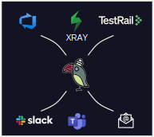
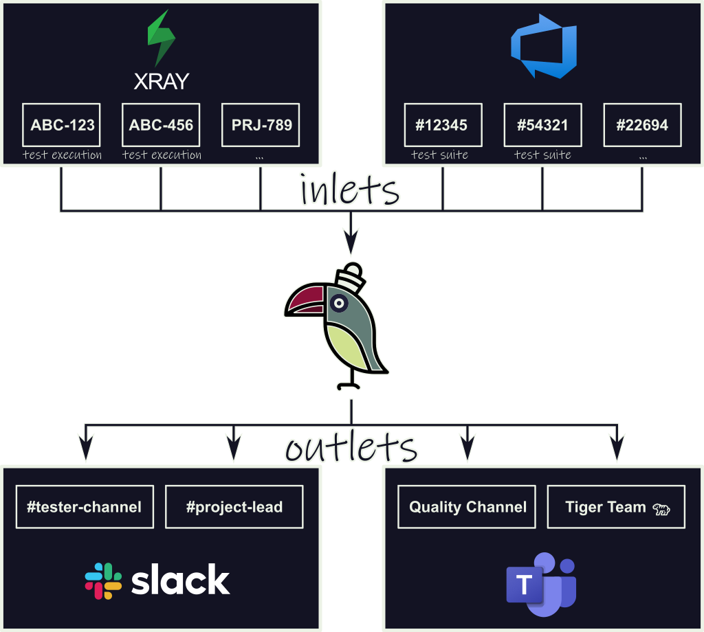

<h1>
  <span>
    Parrot
    
  </span>
</h1>

[](https://www.npmjs.com/package/@qytera/parrot)
[](https://www.npmjs.com/package/@qytera/parrot)
[](https://github.com/Qytera-Gmbh/parrot/issues?q=is%3Aissue+is%3Aopen)
[](https://github.com/Qytera-Gmbh/parrot/issues?q=is%3Aissue+is%3Aopen+no%3Aassignee)

A flexible and extensible tool for aggregating test results and forwarding them to various destinations, such as HTML reports, Microsoft Teams or Slack. Designed to bridge the gap between testers and management.



Planned features:

- Xray test results aggregation
- Microsoft Teams integration
- Slack integration
- HTML output
- Email integration

> [!WARNING]
> The tool is at a very early stage of development and may frequently introduce breaking changes.

# Installation

```bash
npm install @qytera/parrot
```

# Terminology

Using Parrot means interacting with two main components:

- **Sources**: Sources represent tools, services or files from which test results can be read.

  - Examples: Xray, TestRail

  - **Inlets**: Inlets are the actual entities which store test result data. Sources can be reused to access multiple inlets.

    - Examples: Xray test plans, Xray test sets

- **Drains**: Drains represent tools, services or files into which test results obtained from one or more sources can be written in a human-readable way.

  - Examples: Microsoft Teams, Email

  - **Outlets**: Outlets are the entities which test result data can be written to. Drains can be reused to access multiple outlets.

    - Examples: Microsoft Teams channel, Slack channel



# Usage

Parrot comes with an easy-to-use CLI for configuring sources and drains.

```console
npx parrot --help

Usage: parrot [options]

Options:
  -d, --drain-file <drain-file>       path to a saved drain configuration file
  -e, --env-file <env-file...>        one or more .env files to load environment variables from
  -p, --plugin-file <plugin-file...>  one or more Parrot plugin files to load
  -s, --source-file <source-file>     path to a saved source configuration file
  -h, --help                          display help for command
```

Source and drain configurations can be saved to files for later reuse, speeding up subsequent Parrot runs.

> [!NOTE]
> Note that sensitive values such as usernames or passwords are not stored in the configuration files.
> Which values to save and which to omit is baked into the source and drain implementations.
>
> However, Parrot can parse `.env` files and load their values into the environment before it starts.
> This makes the CLI experience smoother by pre-populating configuration values and reducing the number of interactive questions asked.
>
> If your [custom source or drain](#custom-plugins) relies on environment variables (e.g. credentials, endpoints, default filters), simply access them via `process.env` in your plugin logic.

## Example: Xray → Microsoft Teams

Initial setup:

https://github.com/user-attachments/assets/e789b9a5-5150-41ac-bad0-1757c069a646

Setup with reused source configuration:

https://github.com/user-attachments/assets/263ee870-59c3-4922-a964-e4fbd8b8b27c

# Custom Plugins

Parrot was designed with extensibility in mind.
You can easily add your own logic using the `--plugin-file` CLI parameter.
This allows you to register your own data sources or behaviours at runtime.

To load one or more plugin files, simply pass them when running the CLI:

```sh
npx parrot --plugin-file ./my-plugin.js ./another-plugin.ts
```

Each plugin should call `configureParrot()` to hook into the system.

```js
// my-plugin.js
import { configureParrot } from "@qytera/parrot";

await configureParrot((config) => {
  return {
    sources: {
      ["some other service"]: {
        ["nested source"]: new MyNewNestedSourceHandler(),
      },
    },
    drains: {
      ["my new drain"]: new MyNewDrainHandler(),
    },
  };
});
```

You can define top-level or nested sources, depending on your use case.
All plugins specified are added to the plugins that come with Parrot, allowing a modular composition of features.

## Implementation

> [!NOTE]
> Parrot comes with a number of built-in plugins that you can use as a reference.
> Check out the [`plugins`](./src/cli/plugins/) directory in the repository to see how existing sources and drains are implemented in practice.

When implementing a new plugin, you'll need to extend the following abstract classes to define how data is fetched and where it is sent:

- Custom Sources

  - [`Source`](./src/source.ts): Responsible for fetching the actual test results from a source.
  - [`SourceHandler`](./src/cli/cli-source-handler.ts): Responsible for building the source configuration (e.g. via CLI prompts) and instantiating the actual source.

- Custom Drains

  - [`Drain`](./src/drain.ts): Responsible for writing the test summary to a drain (e.g. a reporting system, file, or API).
  - [`DrainHandler`](./src/cli/cli-drain-handler.ts): Responsible for building the drain configuration (e.g. via CLI prompts) and instantiating the actual drain.

Each of these base classes provides the necessary structure and lifecycle hooks to ensure that your plugin integrates cleanly into the Parrot runtime.
